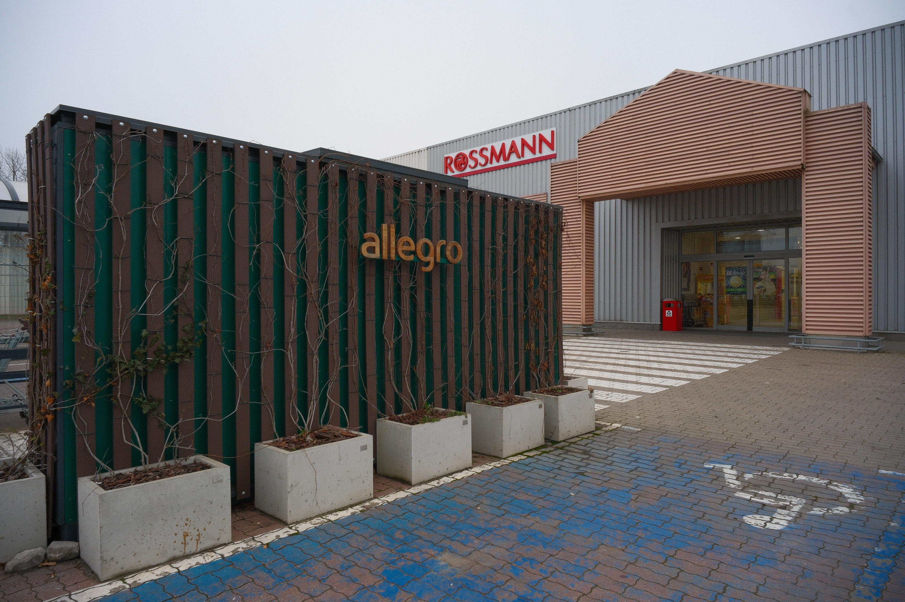
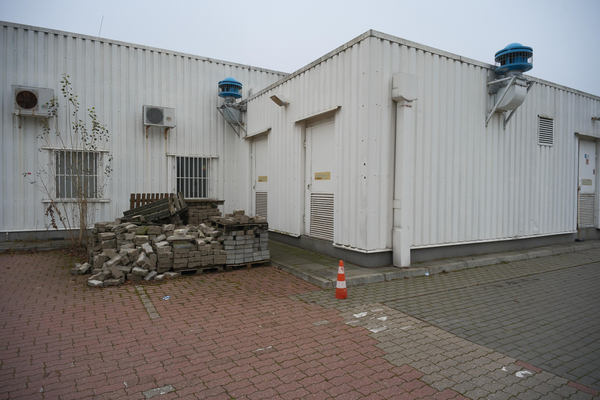
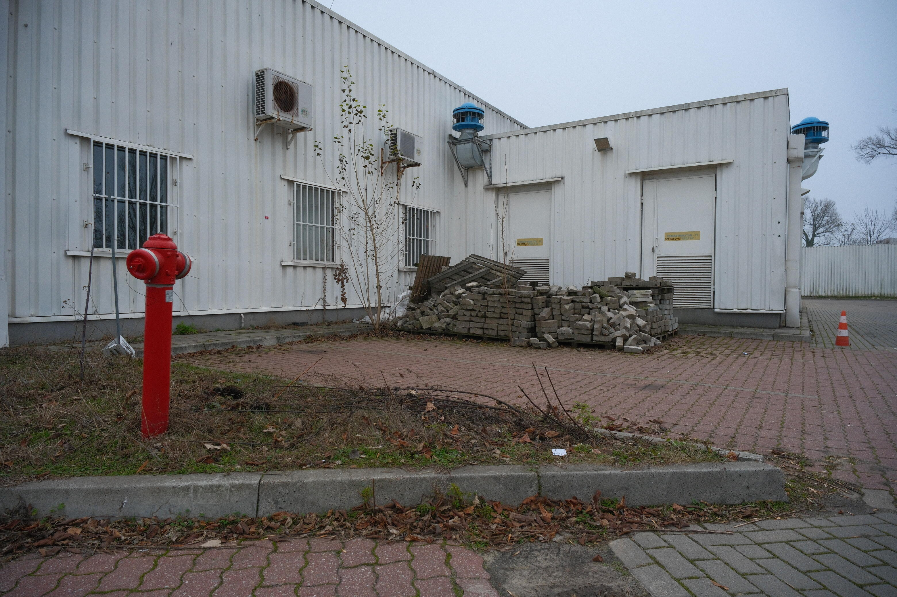
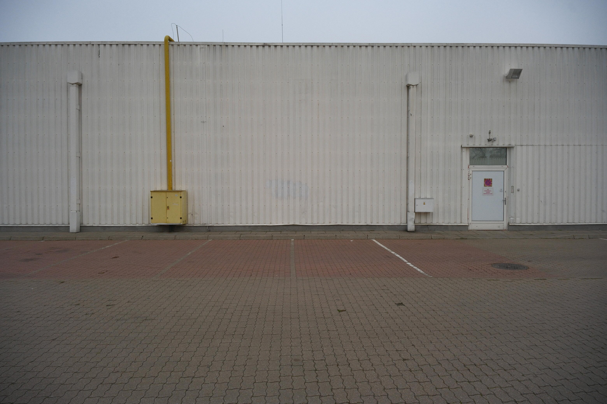
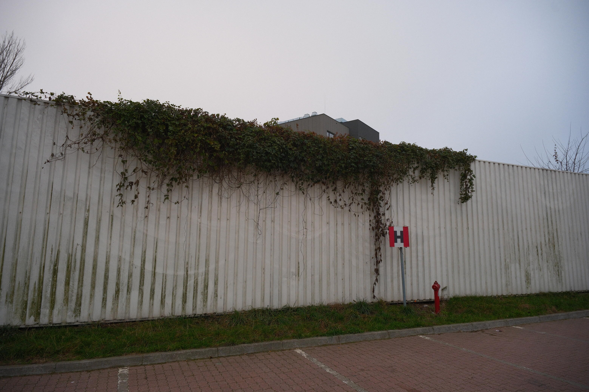
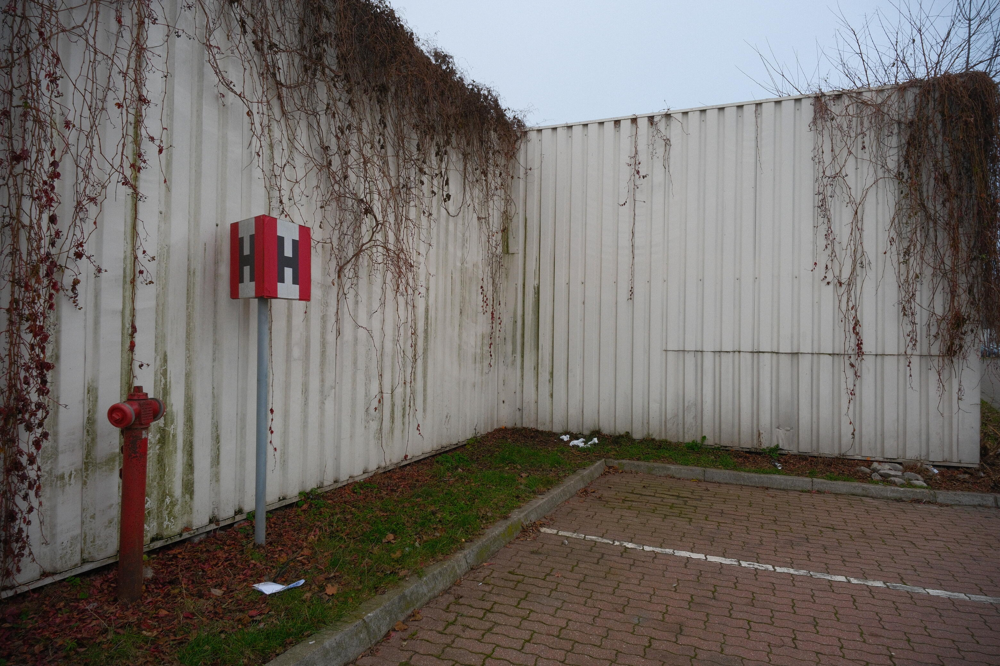
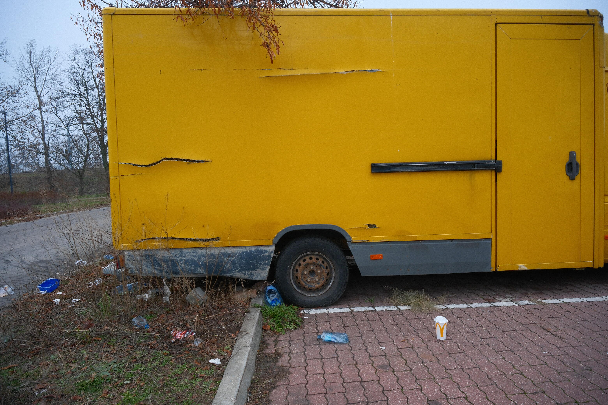
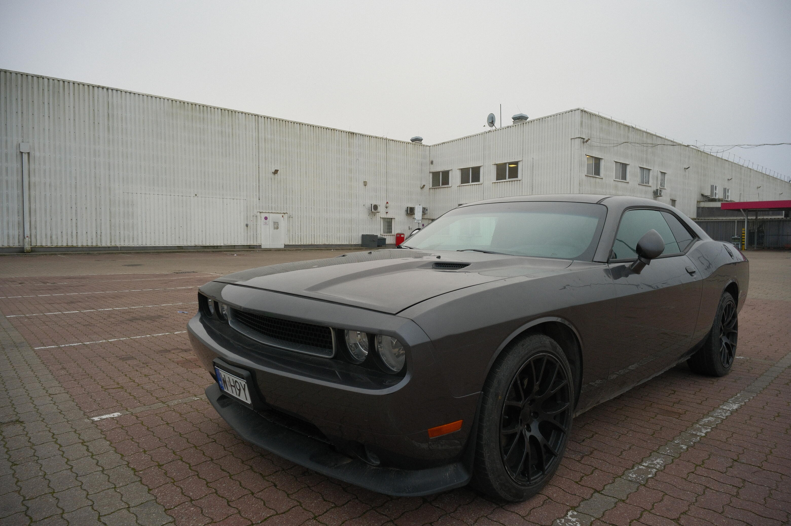

+++
title = 'M2 Szwedzka'
date = '2025-11-30'
published = '2026-01-05'
author = 'Szczyp'
+++

There are three metro stops in Praga. Today I’m visiting the newest one, located in the oldest surviving part of the district — a place that largely remained standing after the war. Bordering Targówek just beyond the rail line and only about 2.5 km from the Royal Castle, my destination is a relic of the 1990s: the first hypermarket in this part of Warsaw.

The large, once-white corrugated metal structure, built nearly 30 years ago, contrasts sharply with the red brick buildings of slowly gentrifying Praga. Its vast parking lot, littered with trash and sparsely filled with semi-abandoned cars — some perhaps stolen — makes you feel that this place’s days are numbered, soon to be razed and reborn.


    
    
    
    
    
    
    
    

