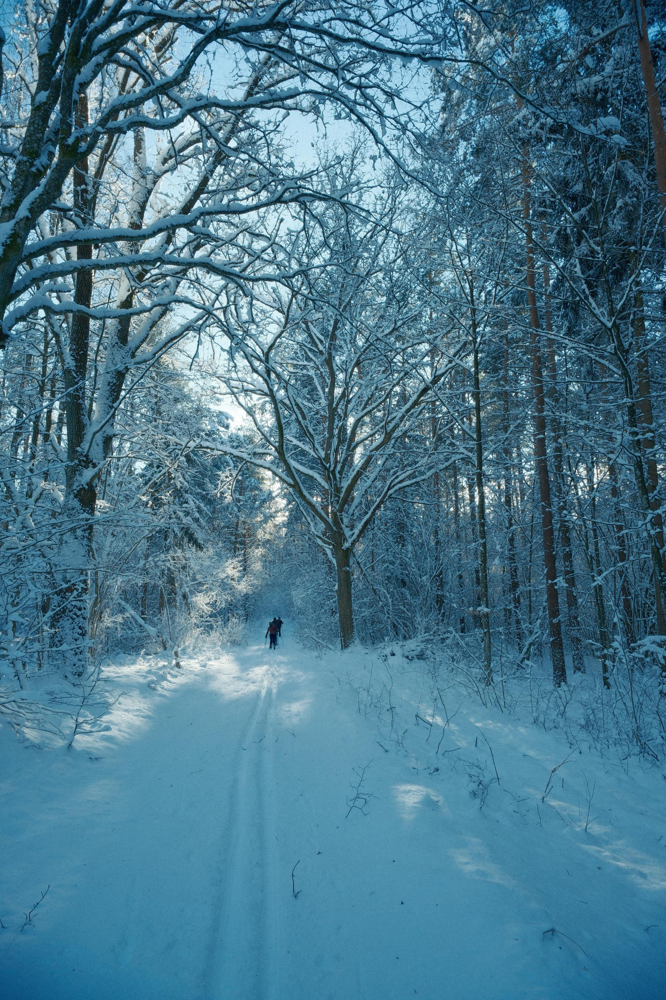
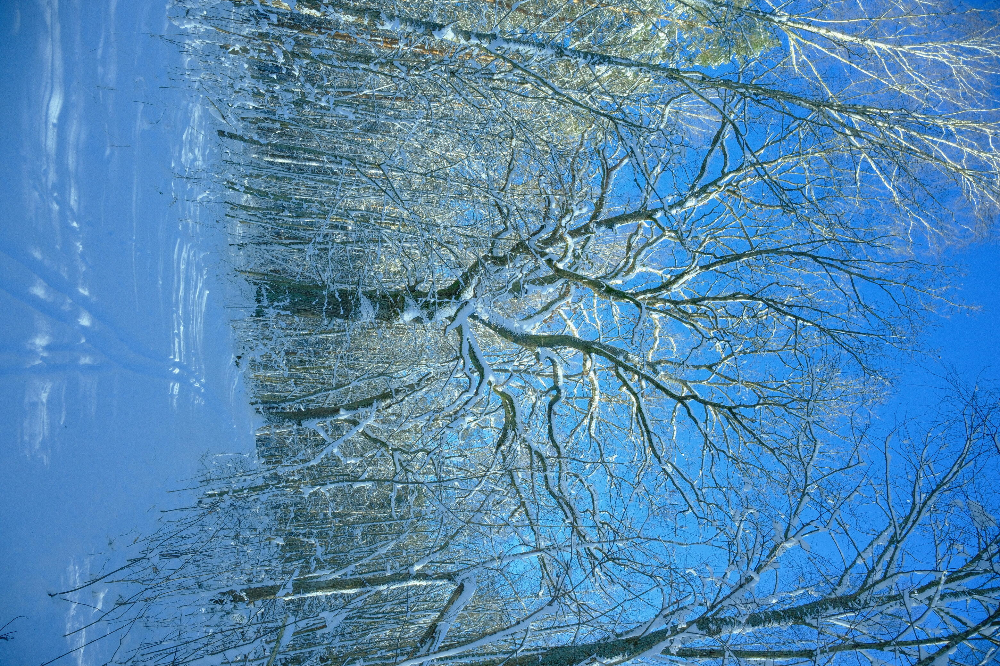
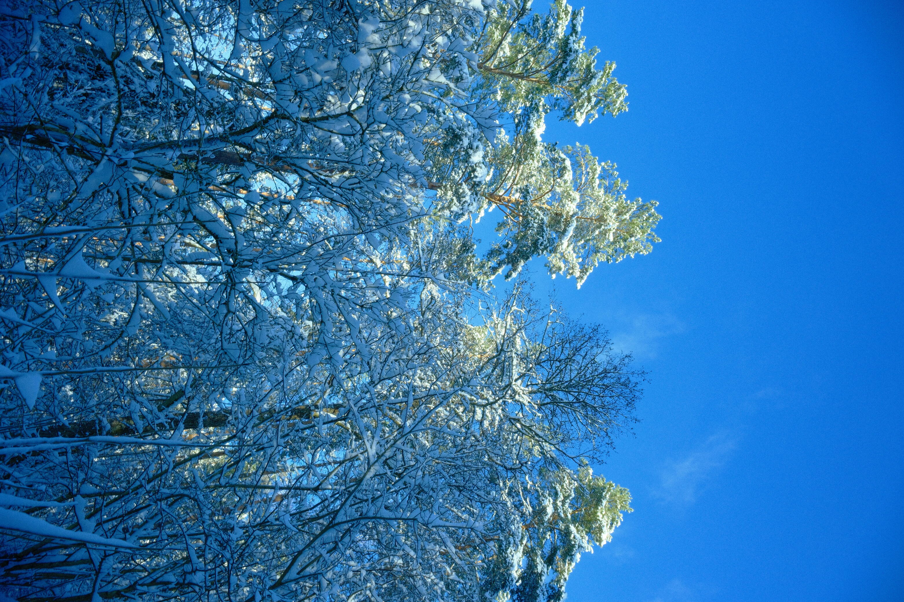
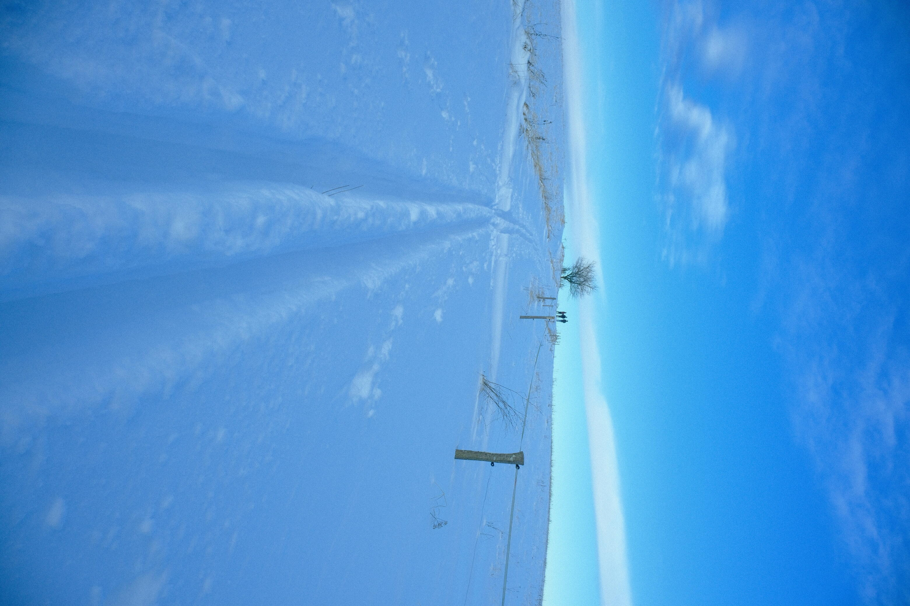
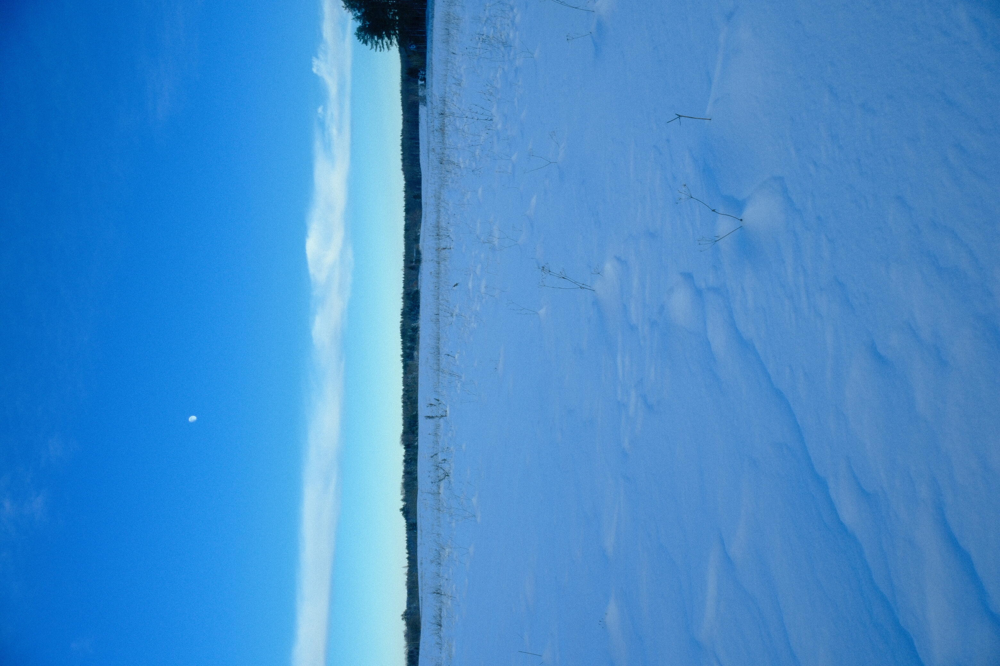

+++
title = 'Ublik'
date = '2025-12-31'
published = '2026-01-07'
author = 'Szczyp'
+++

The last day of the year, and the weather couldn’t be lovelier. It had been snowing heavily for several days, but the clouds finally cleared, creating a perfect opportunity for cross-country skiing. The sun sits very low this time of year, so only the higher parts of the forest received any direct light, aside from a few rays slipping through the canopy and striking the fluffy snow below.


    
    


It grew chilly as we left the forest’s wind-protecting shade and entered the open, hunched fields of Mazury, with the moon patiently waiting its turn to shine as the sun slowly arced toward the horizon.


    
    

